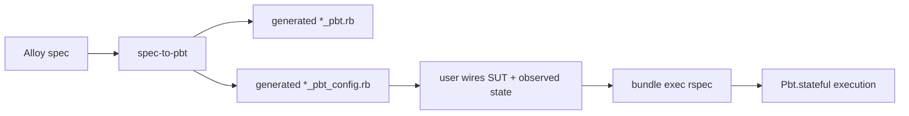

# Conference Summary

This document is the slide-ready summary for the current conference package.

Use it as the source for:

- one overview slide
- one evidence slide
- one limitations / next-step slide

## Core Claim

`spec-to-pbt` is a practical scaffold generator for formal-spec-to-PBT workflows.

The current evidence supports three claims:

1. **Viability**
   - formal specs can be turned into runnable stateful PBT scaffolds
2. **Practicality**
   - the scaffold can reach green through config/impl-only edits
3. **Usefulness**
   - the resulting tests detect realistic injected defects across recurring pattern families

## Slide 1: Workflow

Presenter note:

- emphasize that `*_pbt.rb` is regenerated
- emphasize that durable customization lives in config
- state clearly that this is a practical scaffold workflow, not a semantics-preserving translator

## Slide 2: 4-Domain Evidence

| Domain | Family | `*_pbt.rb` edited? | Green via config/impl only? | Mutants detected |
| --- | --- | --- | --- | --- |
| partial refund / remaining capturable | paired amount movement | no | yes | 2 / 3 |
| ledger projection | append-only projection | no | yes | 3 / 3 |
| job status event counters | status-gated counters / lifecycle | no | yes | 3 / 3 |
| connection pool | bounded paired counters | no | yes | 2 / 3 |

Presenter note:

- this is the main practicality + usefulness slide
- the most important row is the `*_pbt.rb` column: no hand edits in generated scaffold

## Slide 3: What The Generator Already Handles

| Pattern family | Status |
| --- | --- |
| collection mutation | first-class |
| scalar mutation | first-class |
| paired counters / conservation | first-class |
| append-only projection | first-class |
| lifecycle status transitions | first-class / config-assisted |
| status + projection + amount/counter | config-assisted |
| business-rule-heavy invalid paths | config-owned |

Presenter note:

- this is the boundary slide
- frame the tool as intentionally conservative
- highlight that config is a design choice, not an accident

## Slide 4: What The Current Package Shows

### Strong evidence

- repeated recurring pattern support across unrelated domains
- deterministic end-to-end workflow
- strong mutant detection for:
  - projection bugs
  - wrong update direction
  - wrong counter updates
  - lifecycle transition bugs

### Weak evidence

- invalid-path bugs that are never exercised because generated workflows stay on valid paths
- business-rule-heavy mixed guards

## Slide 5: Main Limitation

The current system is strongest on:

- structurally inferable updates
- structurally inferable simple guards
- observed-state verification with explicit config wiring

It is weaker on:

- mixed guards such as `status == constant && scalar > 0`
- domain-specific invalid-path semantics
- external side effects

## Slide 6: Takeaway

The takeaway should be:

- we are not claiming full automatic completed test generation
- we are claiming that **formal specs can be turned into practical, useful stateful PBT scaffolds**
- the recurring structural core is already broad enough to support a real case-study argument
