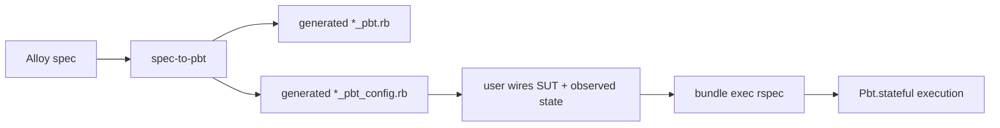

# Evaluation Summary

This document summarizes the current 4-domain product evaluation package.

Use it as a compact overview of:

- the workflow under evaluation
- the strongest evidence
- the current boundary
- the main limitation

## Core Claim

`spec-to-pbt` is a practical scaffold generator for formal-spec-to-PBT workflows.

The current evidence supports three claims:

1. **Viability**
   - formal specs can be turned into runnable stateful PBT scaffolds
2. **Practicality**
   - the scaffold can reach green through config/impl-only edits
3. **Usefulness**
   - the resulting tests detect realistic injected defects across recurring pattern families

## Workflow

Key points:

- `*_pbt.rb` is regenerated
- durable customization lives in config
- this is a practical scaffold workflow, not a semantics-preserving translator

## 4-Domain Evidence

| Domain | Family | `*_pbt.rb` edited? | Green via config/impl only? | Mutants detected |
| --- | --- | --- | --- | --- |
| partial refund / remaining capturable | paired amount movement | no | yes | 2 / 3 |
| ledger projection | append-only projection | no | yes | 3 / 3 |
| job status event counters | status-gated counters / lifecycle | no | yes | 3 / 3 |
| connection pool | bounded paired counters | no | yes | 2 / 3 |

## Current Boundary

| Pattern family | Status |
| --- | --- |
| collection mutation | first-class |
| scalar mutation | first-class |
| paired counters / conservation | first-class |
| append-only projection | first-class |
| lifecycle status transitions | first-class / config-assisted |
| status + projection + amount/counter | config-assisted |
| business-rule-heavy invalid paths | config-owned |

The generator is intentionally conservative. Config is a design boundary, not an accident.

## Strong Evidence

- repeated recurring pattern support across unrelated domains
- deterministic end-to-end workflow
- strong defect detection for:
  - projection bugs
  - wrong update direction
  - wrong counter updates
  - lifecycle transition bugs

## Weak Evidence

- invalid-path bugs that are never exercised because generated workflows stay on valid paths
- business-rule-heavy mixed guards

## Takeaway

- this is not full automatic completed test generation
- it is practical, useful stateful PBT scaffold generation from formal-ish specs
- the recurring structural core is already broad enough to support a credible product-level case study
